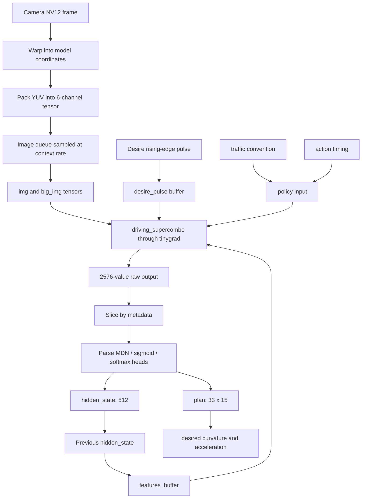

# openpilot Driving Model Walkthrough

Date: 2026-06-18

Repo being read:

`commaai/openpilot`

This note is intentionally about the model side only. It skips process orchestration, message buses, OBD, car ports, panda, CAN, and harness work.

## The Mental Model

openpilot's driving model is not just "a CNN that sees lanes." In the current repo, the important object is a driving policy model that takes camera history plus a small amount of driving context and returns a compact prediction vector. That vector is then decoded into a future plan, probabilities, auxiliary perception outputs, a hidden state, and finally a driving action.

Think of the runtime loop like this:

```text
camera frame
  -> perspective warp into model view
  -> YUV packing into neural-net tensor
  -> temporal queues
  -> driving_supercombo.onnx through tinygrad
  -> raw vector of 2576 floats
  -> output slices
  -> parsed plan / metadata / hidden state
  -> desired curvature + desired acceleration
```

The key point: the model output is not only a rendered lane/path visualization. The part that matters for driving is the predicted plan/action. The perception-looking outputs still exist, but the driving model path is centered around policy output.

## Files To Keep Open

Read these in this order:

1. `selfdrive/modeld/models/README.md`
2. `selfdrive/modeld/constants.py`
3. `common/transformations/model.py`
4. `selfdrive/modeld/compile_modeld.py`
5. `selfdrive/modeld/modeld.py`
6. `selfdrive/modeld/parse_model_outputs.py`
7. `selfdrive/modeld/fill_model_msg.py`
8. `selfdrive/controls/lib/drive_helpers.py`

Do not start with the whole openpilot repo. For the model, these are enough.

## The Actual Model Files

In:

`selfdrive/modeld/models`

There are three ONNX files:

```text
driving_supercombo.onnx      normal driving model, about 58 MB
big_driving_supercombo.onnx  bigger driving model, about 186 MB
dmonitoring_model.onnx       driver monitoring model, separate topic
```

For this walkthrough, focus on:

```text
driving_supercombo.onnx
```

The normal driving model's embedded metadata says:

```text
checkpoint:
  6a7d09ad-bcc9-43bc-916d-29287e60cee2/200/a27b3122-733e-4a65-938b-acfebebbe5e8/100

inputs:
  img                (1, 12, 128, 256)
  big_img            (1, 12, 128, 256)
  features_buffer    (1, 24, 512)
  desire_pulse       (1, 25, 8)
  traffic_convention (1, 2)
  action_t           (1, 2)

output:
  outputs            (1, 2576)
```

The entire neural network returns one vector of 2576 values. openpilot then slices this vector by name:

```text
meta                    0:55
desire_pred             55:87
pose                    87:99
wide_from_device_euler  99:105
road_transform          105:117
lane_lines              117:645
lane_lines_prob         645:653
road_edges              653:917
lead                    917:1061
lead_prob               1061:1064
hidden_state            1064:1576
plan                    1576:2566
desire_state            2566:2574
pad                     -2:
```

This metadata is read by:

`selfdrive/modeld/get_model_metadata.py`

The parser uses it at runtime through:

`selfdrive/modeld/modeld.py`

## Important Constants

The model constants live in:

`selfdrive/modeld/constants.py`

The most important values:

```text
IDX_N = 33
MODEL_RUN_FREQ = 20
MODEL_CONTEXT_FREQ = 5
FEATURE_LEN = 512
DESIRE_LEN = 8
PLAN_WIDTH = 15
ACTION_WIDTH = 2
```

`IDX_N = 33` means many future trajectories are represented at 33 time or distance points.

`T_IDXS` is the future time grid. It spans about 10 seconds, but it is not linearly spaced. It uses:

```python
max_val * ((idx / max_idx) ** 2)
```

That means the model has denser resolution near "now" and sparser resolution farther into the future. This is sensible because a near-future prediction needs high precision; a far-future prediction is inherently less certain.

`X_IDXS` is similar but for distance along the road, up to about 192 meters.

## Input 1: `img`

Shape:

```text
(1, 12, 128, 256)
```

This is not a normal RGB image.

The model receives two consecutive model frames. Each model frame is packed as 6 YUV-derived channels. So:

```text
2 frames * 6 channels = 12 channels
```

Each packed frame has spatial shape:

```text
128 x 256
```

But the source model view is:

```text
512 x 256
```

The Y plane is split into four checkerboard channels, then U and V are added:

```text
Y even row / even col
Y odd row  / even col
Y even row / odd col
Y odd row  / odd col
U
V
```

This happens in:

`selfdrive/modeld/compile_modeld.py`

Function:

```python
frames_to_tensor()
```

Why this design exists:

1. Camera buffers are naturally YUV/NV12 in the runtime system.
2. Packing Y this way preserves pixel information while reducing spatial size.
3. It avoids doing an RGB conversion just to feed the model.
4. It makes the input compact and hardware-friendly.

## Input 2: `big_img`

Shape:

```text
(1, 12, 128, 256)
```

This has the same tensor shape as `img`, but it comes from a different camera/view path. Conceptually, it gives the model another visual framing of the world.

The important part for learning:

```text
img and big_img are two synchronized visual streams.
```

Do not think of `big_img` as a bigger tensor here. In the runtime contract, the shape is the same; the source view/calibration path differs.

## Input 3: `features_buffer`

Shape:

```text
(1, 24, 512)
```

This is the temporal memory bridge.

The model emits a hidden state:

```text
hidden_state slice: 1064:1576
length: 512
```

After each inference, openpilot stores that hidden state as `prev_feat`:

```python
self.npy['prev_feat'][:] = model_output[self.output_slices['hidden_state']]
```

Next inference, that value is pushed into a rolling feature queue:

```python
feat_buf = shift_and_sample(feat_q, prev_feat.reshape(1, 1, -1), sample_skip_fn)
```

This is how the model gets temporal context without directly passing a giant image sequence. It sees current images plus a history of compact learned features.

The code comment says:

```python
# past features only; the model appends the current frame's feature
```

So `features_buffer` is not raw pixels. It is learned recurrent-ish memory.

## Input 4: `desire_pulse`

Shape:

```text
(1, 25, 8)
```

This is a short temporal buffer of desired maneuvers. The width is 8 desire categories.

Important: openpilot does not feed the desire as a continuously held value. It converts it into a rising-edge pulse:

```python
self.npy['desire'][:] = np.where(
  inputs['desire_pulse'] - self.prev_desire > .99,
  inputs['desire_pulse'],
  0
)
```

Interpretation:

```text
"A new desire just started" matters more than "the desire is still active."
```

The comment in `modeld.py` says:

```python
# Model decides when action is completed, so desire input is just a pulse triggered on rising edge
```

This is policy-like behavior. The high-level desire tells the model "begin this behavior"; the model decides how to execute it over time.

## Input 5: `traffic_convention`

Shape:

```text
(1, 2)
```

This tells the model which side-of-road convention applies.

For the model walkthrough, treat it simply as:

```text
left-hand traffic vs right-hand traffic context
```

## Input 6: `action_t`

Shape:

```text
(1, 2)
```

This carries timing assumptions for action extraction:

```text
lat_action_t
long_action_t
```

The model/action extraction needs this because the desired action is not "instantaneous." There is latency and a target time horizon. For example, curvature or acceleration desired at a short future horizon is more useful than a purely now-time prediction.

## Perspective Warp

Before an image reaches the model, openpilot warps the camera frame into the model coordinate system.

The model input size is defined in:

`common/transformations/model.py`

```python
MEDMODEL_INPUT_SIZE = (512, 256)
```

The model intrinsics are also defined there:

```python
medmodel_fl = 910.0
medmodel_intrinsics = ...
```

The key function:

```python
get_warp_matrix(device_from_calib_euler, intrinsics, bigmodel_frame=False)
```

This builds the transform from camera/device coordinates into model-view coordinates.

The actual pixel sampling happens in:

`selfdrive/modeld/compile_modeld.py`

Function:

```python
warp_perspective_tinygrad()
```

Algorithm:

```text
for every output model pixel:
  create output x,y coordinate
  apply inverse 3x3 perspective matrix
  divide by perspective depth w
  round to nearest source pixel
  clip to camera bounds
  sample source Y/U/V value
```

The code does this with tensor operations so tinygrad can compile it efficiently.

The warp step matters because the neural network should see a stable virtual camera view even if the physical camera calibration differs slightly.

## Runtime Queues

The model does not just consume one frame and forget everything. It keeps rolling queues.

In:

`selfdrive/modeld/compile_modeld.py`

Core helper:

```python
shift_and_sample(buf, new_val, sample_fn)
```

It does:

```text
drop oldest item
append newest item
sample buffer into model input shape
```

For image and feature buffers, it samples every `frame_skip`.

```python
frame_skip = MODEL_RUN_FREQ // MODEL_CONTEXT_FREQ
           = 20 // 5
           = 4
```

Meaning:

```text
model loop:       20 Hz
context sampling: 5 Hz
keep every 4th item for context
```

This gives the model temporal context without feeding every single frame in the history.

## Model Execution

The ONNX model is not interpreted naively every frame. openpilot compiles pieces into a tinygrad pickle.

Build/runtime compile path:

`selfdrive/modeld/SConscript`

It runs:

```text
compile_modeld.py
  --model-size 512x256
  --camera-resolutions ...
  --onnx models/driving_supercombo.onnx
  --output models/driving_tinygrad.pkl
  --frame-skip 4
```

The compiled pickle contains:

```text
metadata
run_policy tinygrad function
warp functions for supported camera resolutions
```

At runtime, `ModelState` loads that pickle:

```python
jits = pickle.loads(read_file_chunked(modeld_pkl_path(usbgpu)))
metadata = jits['metadata']
self.input_shapes = metadata['input_shapes']
self.output_slices = metadata['output_slices']
self.run_policy = jits['run_policy']
self.warp_enqueue = jits[(cam_w, cam_h)]
```

So runtime inference is:

```text
warp camera frame
update queues
call run_policy(...)
get raw vector
slice and parse
```

## Raw Output Vector

The model returns:

```text
(1, 2576)
```

That vector is not meaningful until sliced.

`ModelState.slice_outputs()` does:

```python
parsed_model_outputs = {
  k: model_outputs[np.newaxis, v]
  for k, v in output_slices.items()
}
```

So:

```text
raw[1576:2566] becomes plan
raw[1064:1576] becomes hidden_state
raw[0:55] becomes meta
...
```

This is a common production ML pattern:

```text
one network output tensor
plus metadata describing named heads
```

## Output Parsing

Parsing lives in:

`selfdrive/modeld/parse_model_outputs.py`

There are three parser types:

```text
sigmoid  -> binary probabilities
softmax  -> categorical probabilities
MDN      -> means and uncertainty/stds
```

MDN means mixture density network.

The parser expects raw outputs to contain:

```text
means
log/std-like values
possibly hypothesis weights
```

Then it converts them into:

```text
prediction values
prediction standard deviations
possibly best hypothesis
```

The model uses MDN parsing for outputs where uncertainty matters:

```text
pose
road_transform
lane_lines
road_edges
lead
plan
```

The `plan` parser:

```python
self.parse_mdn(
  'plan',
  outs,
  in_N=0,
  out_N=0,
  out_shape=(ModelConstants.IDX_N, ModelConstants.PLAN_WIDTH)
)
```

So the parsed plan shape is:

```text
(batch, 33, 15)
```

## What Is In The Plan?

`PLAN_WIDTH = 15`.

The 15 channels are grouped in:

`selfdrive/modeld/constants.py`

```python
POSITION             = slice(0, 3)
VELOCITY             = slice(3, 6)
ACCELERATION         = slice(6, 9)
T_FROM_CURRENT_EULER = slice(9, 12)
ORIENTATION_RATE     = slice(12, 15)
```

For each of the 33 future time points, the model predicts:

```text
position:         x, y, z
velocity:         x, y, z
acceleration:     x, y, z
orientation:      roll-ish/pitch-ish/yaw-ish representation
orientation rate: roll/pitch/yaw rates
```

For driving action extraction, the most important pieces are:

```text
velocity/acceleration -> desired longitudinal acceleration
yaw/yaw_rate          -> desired curvature
```

## From Plan To Action

This conversion happens in:

`selfdrive/modeld/modeld.py`

Function:

```python
get_action_from_model()
```

If the model output contains direct `action`, it uses that. In the current metadata we inspected, there is no `action` output slice, so it falls back to deriving action from `plan`.

Longitudinal action:

```python
desired_accel, should_stop = get_accel_from_plan(...)
```

Lateral action:

```python
desired_curvature = get_curvature_from_plan(...)
```

Those helper functions live in:

`selfdrive/controls/lib/drive_helpers.py`

Important formulas:

```python
curv_from_psi = psi_target / (vego * action_t)
curvature = 2 * curv_from_psi - psi_rate / vego
```

Conceptually:

```text
curvature tells the car how sharply to bend its path.
lateral acceleration is approximately curvature * speed^2.
```

So at higher speed, the same curvature produces much larger lateral acceleration.

This is the bridge from ML prediction to a control target.

## What The Model Is Learning

From the runtime code alone, you can infer the deployed model is learning a mapping like:

```text
visual scene
+ short visual history
+ compact feature history
+ maneuver pulse
+ traffic convention
+ action timing
------------------------------------------------
future ego plan
+ auxiliary perception outputs
+ lead/road/lane predictions
+ disengagement/hard-brake probabilities
+ hidden state for next step
```

From comma's 0.11 release post, the broader ecosystem direction is:

```text
fleet data
  -> large learned simulator / world model
  -> train smaller driving policy through interaction
  -> deploy compact policy model
```

So for your learning, separate two things:

```text
training ecosystem: world model, fleet data, RL/on-policy-ish policy training
runtime repo code: preprocessing, model execution, output parsing, action extraction
```

The public openpilot repo mostly shows the runtime side. It does not include the full internal training stack for the driving model.

## What The Auxiliary Outputs Mean

The output vector includes more than the plan:

```text
lane_lines
road_edges
lead
lead_prob
pose
road_transform
wide_from_device_euler
desire_pred
desire_state
meta
hidden_state
```

These are useful for:

```text
visualization
monitoring confidence
fallback/compatibility paths
debugging
other modules that need interpreted geometry/probabilities
```

But if your goal is the E2E driving model, do not get stuck thinking lane lines are the central algorithm. The central algorithm is:

```text
predict a future plan/action from camera context.
```

## What `fill_model_msg.py` Does

This file turns parsed arrays into structured output fields.

For learning the model, read only the conversion logic:

```python
fill_xyzt(modelV2.position, ...)
fill_xyzt(modelV2.velocity, ...)
fill_xyzt(modelV2.acceleration, ...)
fill_xyzt(modelV2.orientation, ...)
fill_xyzt(modelV2.orientationRate, ...)
modelV2.action = action
```

It also fills:

```text
lane lines
road edges
leads
meta probabilities
confidence color
```

The important thing is that `fill_model_msg.py` is not the model. It is output formatting after inference.

## The End-To-End Data Flow



## How This Relates To The Controls Challenge

The comma leaderboard includes an active controls challenge:

`https://comma.ai/leaderboard`

The challenge repo:

`https://github.com/commaai/controls_challenge`

The challenge says:

```text
Machine learning models can drive cars... But they famously suck at doing low level controls.
Your goal is to write a good controller.
```

That sentence is the connection.

In openpilot model runtime:

```text
driving model -> desired curvature / desired acceleration
```

In controls challenge:

```text
controller -> steering command that makes simulated lateral acceleration track target lateral acceleration
```

The challenge simulator, TinyPhysics, is a learned autoregressive lateral dynamics model. It takes:

```text
v_ego
a_ego
road_lataccel
current_lataccel
steer_action
```

and predicts:

```text
next lateral acceleration
```

Your controller implements:

```python
update(target_lataccel, current_lataccel, state, future_plan)
```

The baseline PID is roughly:

```python
error = target_lataccel - current_lataccel
error_integral += error
error_diff = error - prev_error
steer = p * error + i * error_integral + d * error_diff
```

The leaderboard methods include:

```text
direct quadratic optimization
optimized actions
MPC
PPO
PID + feedforward
evolution / Bayesian optimization
```

This is why the controls challenge is relevant to your RL/PufferLib interest:

```text
It is a small, measurable control environment where a policy/controller is evaluated by rollout cost.
```

But do not confuse it with the openpilot driving model:

```text
openpilot driving model:
  perception + policy -> target plan/action

controls challenge:
  target lateral acceleration -> steering action in learned simulator
```

The first is "what should the car do?"
The second is "how do I actuate the car so it actually does that?"

## What To Learn First

Do not try to learn every openpilot subsystem at once. For the model, use this order:

### Step 1: Shapes

Memorize this contract:

```text
img                (1, 12, 128, 256)
big_img            (1, 12, 128, 256)
features_buffer    (1, 24, 512)
desire_pulse       (1, 25, 8)
traffic_convention (1, 2)
action_t           (1, 2)
outputs            (1, 2576)
```

If you know these shapes, the code starts making sense.

### Step 2: Preprocessing

Understand:

```text
camera frame -> warp -> YUV pack -> temporal image queue
```

Read:

`compile_modeld.py`

Functions:

```text
warp_perspective_tinygrad
frames_to_tensor
make_frame_prepare
make_warp
```

### Step 3: Model State

Understand:

```text
ModelState loads compiled model
ModelState owns queues
ModelState runs inference
ModelState stores hidden_state for next frame
```

Read:

`modeld.py`

Class:

```text
ModelState
```

### Step 4: Output Parsing

Understand:

```text
raw vector -> named slices -> parsed distributions/probabilities
```

Read:

`parse_model_outputs.py`

Functions:

```text
parse_mdn
parse_vision_outputs
parse_policy_outputs
```

### Step 5: Action Extraction

Understand:

```text
plan -> desired curvature
plan -> desired acceleration
```

Read:

`modeld.py`

Function:

```text
get_action_from_model
```

Then read:

`drive_helpers.py`

Functions:

```text
get_accel_from_plan
get_curvature_from_plan
```

## One-Frame Walkthrough

At one model tick:

1. Runtime gets the current camera buffer.
2. The buffer is wrapped as a tinygrad tensor without copying.
3. Current calibration gives a 3x3 warp matrix.
4. The warp function samples the camera frame into the model's virtual camera view.
5. NV12/YUV data is packed into 6 model channels.
6. The newest visual tensor is appended to rolling image queues.
7. The previous hidden state is appended to the feature queue.
8. A desire rising-edge pulse is appended to the desire queue.
9. `run_policy` builds the input dictionary.
10. `driving_supercombo.onnx` runs through tinygrad.
11. The model returns 2576 raw values.
12. Metadata slices split those values into named heads.
13. The parser converts logits/raw distribution params into usable outputs.
14. The hidden state is saved for the next tick.
15. The plan is converted into desired curvature and desired acceleration.

That is the model loop.

## What To Ignore For Now

Ignore these until the model loop is clear:

```text
PubMaster / SubMaster
cereal message schemas
panda
CAN
car ports
manager
logger
UI renderer
driver monitoring
calibration internals beyond warp matrix usage
```

They are real and important, but they will overload the model learning path.

## Your RL/PufferLib Angle

For your own E2E project, the closest conceptual mapping is:

```text
openpilot model:
  observation = camera tensors + context buffers
  policy = driving_supercombo
  output = future plan / action

controls challenge:
  observation = vehicle state + target/future plan
  policy/controller = PID/MPC/PPO/etc.
  environment = TinyPhysics learned simulator
  reward/cost = tracking error + jerk/smoothness
```

A clean learning project could be:

```text
Stage 1:
  reproduce controls challenge baseline locally

Stage 2:
  implement PID + feedforward

Stage 3:
  implement MPC or optimized action sequence

Stage 4:
  wrap TinyPhysics as a Gym/PufferLib environment

Stage 5:
  train PPO/other RL policy and compare to PID/MPC

Stage 6:
  write it up as "learned control on comma-style lateral dynamics"
```

That would connect directly to comma's public leaderboard without needing to clone or reproduce their private model training stack.

## Summary

The model side of openpilot is best understood as:

```text
preprocess camera images into stable tensors
maintain temporal context
run a compact deployed policy model
parse a multi-head output vector
convert the future plan into curvature and acceleration targets
```

The controls challenge is related, but it sits one level lower:

```text
given a desired lateral behavior, produce steering actions that track it well.
```

For your current learning goal, master the runtime driving model first, then use the controls challenge as a separate applied controls/RL playground.
